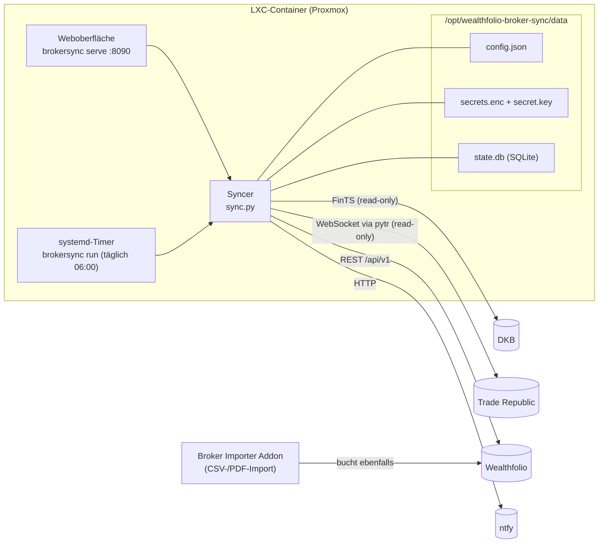
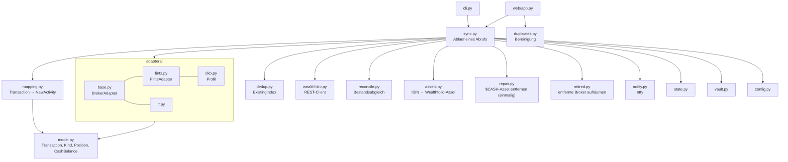
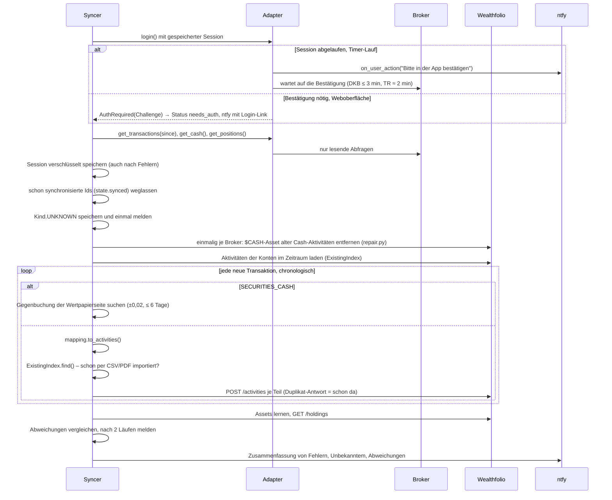

# Architektur

Wie der Wealthfolio Broker Sync aufgebaut ist und wie ein Abruf abläuft. Für die Bedienung siehe [README.md](README.md). Die Regeln, die bei Änderungen gelten (Invarianten, neuen Broker hinzufügen, Release), stehen in [CLAUDE.md](CLAUDE.md). Dieses Dokument erklärt das *Warum* dahinter und wiederholt sie nicht.

## Überblick

Es gibt zwei Prozesse mit demselben Code und demselben Datenverzeichnis:

| Prozess | systemd-Unit | Aufgabe |
|---|---|---|
| `brokersync serve` | `wealthfolio-broker-sync.service` | Weboberfläche: Einrichtung, Broker-Login mit TAN oder App-Bestätigung, Abruf per Knopf, Listen (unbekannte Buchungen, Duplikate, Wertpapiere) |
| `brokersync run` | `wealthfolio-broker-sync-run.service` + `.timer` | Ein Abruf aller aktiven Broker. Exit-Code 1, wenn ein Broker fehlschlug, damit systemd es anzeigt |

Beide laufen als Systembenutzer `brokersync` mit `ProtectSystem=strict` und dürfen nur in `data/` schreiben. Eine Lock-Datei (`data/sync.lock`, `flock`) sorgt dafür, dass immer nur ein Abruf läuft, auch wenn Timer und Weboberfläche gleichzeitig starten.

## Module

Die Schichten hängen nur in eine Richtung voneinander ab:

1. **Adapter** sprechen mit dem Broker und liefern ausschließlich broker-neutrale Objekte aus `model.py`. Sie wissen nichts von Wealthfolio.
2. **Mapping** übersetzt eine `Transaction` in eine oder mehrere Wealthfolio-Aktivitäten, nach denselben Regeln wie das Addon. Es kennt keinen Broker-Code, nur `Kind`.
3. **Sync** verbindet beides und entscheidet, was neu ist.

So kommt ein neuer Broker ohne Änderungen an Mapping und Sync aus.

## Ablauf eines Abrufs

`Syncer.run()` holt sich die Sperre, schließt Läufe, die ein abgestürzter Prozess offen gelassen hat (`aborted`), und arbeitet die Broker nacheinander ab. Jeder Broker läuft in `_run_broker` in einem eigenen `try`. Ein Fehler wird gemeldet und protokolliert, die übrigen Broker laufen weiter.

### Abrufzeitraum (`since`)

| Situation | `since` |
|---|---|
| Erster Lauf | `start_date` des Brokers, sonst alles, was der Broker liefert (bei der DKB 89 Tage, damit keine TAN nötig ist) |
| Danach | letzter erfolgreicher Lauf minus 7 Tage (`OVERLAP`), weil Broker spät buchen |
| Offene Wertpapier-Gegenbuchungen | Das Fenster bleibt bis einen Tag vor der ältesten offenen Buchung offen (`State.oldest_open`) |
| Broker mit Positionen, einmalig | die ganze Historie ab `start_date`, um für den Abgleich zu jeder ISIN das Wealthfolio-Asset zu lernen (`assets-learned:<broker>`) |

Ein Lauf mit Fehlern zählt nicht als Erfolg. Der nächste Lauf fängt deshalb wieder vor ihm an.

## Doppelte Buchungen vermeiden

Dieselbe Buchung kann auf drei Wegen schon in Wealthfolio sein: Der Sync hat sie früher angelegt, ein Lauf brach mitten in einer mehrteiligen Buchung ab, oder das Addon hat sie per CSV/PDF importiert. Drei Schichten fangen das ab:

| Schicht | Wo | Erkennt |
|---|---|---|
| 1. Sync-Status | `state.synced` | Transaktionen, die vollständig angelegt oder als vorhanden erkannt wurden. Sie werden gar nicht erst verarbeitet |
| 2. Wealthfolio-Fingerprint | Wealthfolio (`409 Duplicate activity detected` → `Duplicate`) | Teile, die ein abgebrochener Lauf schon angelegt hat. Der Kommentar mit `[SYNC <broker>:<id>]` gehört zum Fingerprint und darf daher nie umformuliert werden |
| 3. Abgleich mit Importen | `dedup.ExistingIndex` | Aktivitäten aus CSV/PDF-Importen des Addons: gleiches Konto und gleicher Typ, ≤ 36 h Abstand, gleiche Stückzahl, Betrag ±0,02. Das Symbol muss nicht übereinstimmen (Addon: gemapptes Tickersymbol, Sync: ISIN) |

Geht der Sync-Status verloren (`state.db` gelöscht), findet Schicht 2 alles wieder. `test_lost_state_is_recovered_from_the_comments` prüft das.

Eine Transaktion wird erst als synchronisiert markiert, wenn **alle** ihre Aktivitäten existieren. Ein Kauf besteht zum Beispiel aus Übertrag raus, Übertrag rein und dem Kauf selbst. Bricht der Lauf nach dem ersten Teil ab, legt der nächste Lauf die fehlenden Teile an, und die vorhandenen kommen als `Duplicate` zurück.

Duplikate, die ältere Versionen trotzdem erzeugt haben, findet `duplicates.py` (Seite *Duplikate*). Gelöscht wird nur die Kopie des Syncs und nur nach Bestätigung.

## Buchungsmodell

Jeder Broker hat in Wealthfolio zwei Konten: ein **Cash-Konto** und ein **Depot**, wie beim Addon. `mapping.py` setzt das um:

| `Kind` | Aktivitäten |
|---|---|
| `BUY` | Cash `TRANSFER_OUT` → Depot `TRANSFER_IN` (gemeinsame `sourceGroupId`), Depot `BUY` |
| `SELL`, `DIVIDEND` | Depot `SELL`/`DIVIDEND`, dann zurück aufs Cash-Konto (Übertragspaar) |
| `BUY` mit `bonus_funded` (Saveback) | `BUY` ohne Übertrag vom Cash-Konto |
| `DEPOSIT`, `WITHDRAWAL`, `INTEREST`, `FEE`, `TAX` | eine Aktivität auf dem Cash-Konto (ohne Asset, Menge und Preis 1) |
| `TAX_REFUND` | `CREDIT` mit Subtyp `TAX_REFUND` |
| `WITHDRAWAL` auf ein eigenes Konto (*Überträge*) | `TRANSFER_OUT` → `TRANSFER_IN` auf das Zielkonto |
| `SECURITIES_CASH` | nichts. Der Sync sucht nur den Übertrag, den die Wertpapierseite gebucht hat |
| `UNKNOWN` | nichts. Gespeichert, auf der Seite *Unbekannt* gelistet, einmal gemeldet |

**Cash-Aktivitäten tragen kein Asset**, auch die Überträge nicht, genau wie die Importe des Addons. Mit Asset bucht Wealthfolio ein `TRANSFER_IN`/`TRANSFER_OUT` als Wertpapierübertrag dieses Assets, und es fließt kein Geld. Versionen vor 0.3.6 haben Cash-Aktivitäten mit dem Asset `$CASH-<Währung>` angelegt. `repair.py` ändert die eigenen davon einmal je Broker auf „kein Asset“ (`PUT /activities` mit `asset: {}`), statt sie zu löschen und neu anzulegen; Ids, Sync-Status und Übertragspaare bleiben so erhalten. Bis das geklappt hat, bucht der Sync für diesen Broker nichts. Ein erneut gesendeter Übertrag ohne Asset würde sonst nicht als dieselbe Aktivität erkannt und doppelt gebucht. Erledigt ist die Reparatur, wenn das Flag `cash-assets-repaired:<broker>` gesetzt ist.

Beträge sind durchgehend `Decimal`. Gebühr und Steuer stehen in eigenen Feldern, der Betrag eines Kaufs oder Verkaufs ist `trade_final_cash(...)`. Das entspricht genau den Regeln des Addons (`src/pdf/activities.ts`, `src/common.ts`).

## Adapter

Alle Adapter erben von `BrokerAdapter` (`adapters/base.py`) und **lesen nur**: Sie haben keine Methode, die handelt, Geld bewegt oder Einstellungen ändert.

**Login in zwei Schritten.** `login()` versucht die gespeicherte Session. Braucht der Broker die Person (TAN, Code, App-Bestätigung), gibt es zwei Wege:
- In der Weboberfläche wirft der Adapter `AuthRequired(Challenge)`; die Oberfläche zeigt die Abfrage und ruft `complete_login(code)`.
- Bei Timer-Läufen ist `on_user_action` gesetzt; der Adapter schickt eine ntfy-Nachricht und wartet selbst auf die Bestätigung.

**Session.** `session_state()` wird nach jedem Lauf verschlüsselt gespeichert, auch nach Fehlern oder einem halben Login. Bei der DKB ist das der Zustand von python-fints, bei Trade Republic sind es die Cookies.

**Schutz vor Sperre.** Lehnt der Broker die PIN ab, setzt der Adapter `pin_rejected` und kontaktiert ihn nicht mehr, bis die Zugangsdaten neu gespeichert sind. Bei der DKB gilt das auch für eine vorübergehende Sperre. „Zu viele Versuche“ oder Netzfehler setzen das Flag nicht.

| Adapter | Protokoll | Besonderheiten |
|---|---|---|
| `dkb` | FinTS über python-fints (`FintsAdapter`) | Freigabe in der DKB-App (decoupled). Ids sind Hashes des Buchungsinhalts plus Zähler. Wertpapier-Gegenbuchungen auf dem Giro werden zu `SECURITIES_CASH` |
| `tr` | WebSocket der Trade-Republic-App über pytr (fest gepinnt) | Web-Login mit Bestätigung in der App. Timeline (Transaktionen und Aktivitätslog, seitenweise bis `since`), Details in Batches zu 20. Geparst mit pytrs `Event.from_dict` |

Einen Test-Broker liefert der Dienst nicht aus; die Tests nutzen `tests/fake_broker.py`. Den früheren Test-Broker „Dummy“ (bis 0.3.6) räumt `retired.py` beim Start auf: Einstellungen, Zugangsdaten, Sync-Status, Läufe, unbekannte Buchungen und Abgleich werden gelöscht. Seine Buchungen in Wealthfolio bleiben; die Übersicht zeigt einmal, wie viele es sind und wie man sie findet (`[SYNC dummy:`).

**FinTS-Banken** teilen sich `FintsAdapter` (`adapters/fints.py`): Login mit Freigabe in der App oder mit TAN-Eingabe, PIN-Schutz, Session, Abruf und die Einordnung der Giro-Buchungen. Eine Bank ist nur ein Profil (`dkb.py`): Bankleitzahl (fest oder als Zugangsfeld, wenn sie je Filiale verschieden ist), Server, Namen in den Meldungen und, falls die Buchungstexte abweichen, eigene Muster für Wertpapier, Zins und Gebühr. Die Ids hängen nur an der Buchung, nicht am Profil.

Jeder Adapter hat `replay(recording)` für Contract-Tests (`tests/contract/<adapter>/`). Er antwortet dann aus einer Aufzeichnung statt vom Broker.

## Bestandsabgleich

Nach jedem Lauf ohne Fehler vergleicht `reconcile.py` den Kontostand und, bei Adaptern mit `reports_positions`, die Positionen des Brokers mit `GET /holdings` in Wealthfolio:

- **Zusätzliche Prüfungen:** Cash auf dem Depotkonto muss 0 sein, weil jede Zahlung dort vom Cash-Konto kommt oder dorthin zurückgeht. Eine `$CASH`-Position auf einem der beiden Konten weist auf einen alten Übertrag hin, der kein Geld bewegt hat.
- **Positionen ohne ISIN:** Wealthfolio-Positionen tragen keine ISIN. `assets.py` lernt deshalb aus den Aktivitäten von Käufen und Dividenden, unter welchem Asset eine ISIN gebucht ist. Eigene Zuordnungen auf der Seite *Wertpapiere* haben Vorrang.
- **Neuberechnung abwarten:** Wurde etwas angelegt oder repariert, wartet der Sync kurz (`BROKERSYNC_RECALC_WAIT`, Standard 5 s), weil Wealthfolio die Bestände im Hintergrund neu berechnet.
- **Gemeldet wird nur, was bleibt:** erst eine Abweichung, die zwei Läufe in Folge besteht, und dieselbe Menge von Abweichungen nur einmal.

## Daten und Geheimnisse

Alles liegt in `BROKERSYNC_DATA` (Standard `/opt/wealthfolio-broker-sync/data`, Modus 0700):

| Datei | Inhalt | Geschrieben von |
|---|---|---|
| `config.json` | nicht geheime Einstellungen: Wealthfolio-URL, öffentliche URL, ntfy-Server und -Topic, je Broker die Konten, `enabled` und `start_date`, Wertpapier-Zuordnungen, Übertrags-Muster | nur der Weboberfläche |
| `secrets.enc` | Fernet-verschlüsseltes JSON: Wealthfolio-Passwort, Zugangsdaten und Sessions der Broker, ntfy-Token, scrypt-Hash des UI-Passworts, Signierschlüssel der UI-Session | `vault.py`, atomar und mit Lock (zwei Prozesse) |
| `secret.key` | Fernet-Schlüssel, 0600 | einmalig beim ersten Start |
| `state.db` | SQLite, siehe unten | `state.py` |
| `sync.lock`, `secrets.lock` | Sperrdateien | — |

**Tabellen in `state.db`:**

| Tabelle | Inhalt |
|---|---|
| `synced` | `(broker, tx_id)`, Status `imported`/`existing` und die angelegten Aktivitäts-Ids |
| `runs` | Verlauf der Abrufe: `running`, `ok`, `needs_auth`, `error`, `aborted` und die Zähler |
| `unknown_events` | unbekannte Buchungen und offene Wertpapier-Gegenbuchungen, mit einer Nutzlast ohne persönliche Daten |
| `balances`, `reconcile` | letzter Kontostand des Brokers und Abweichungen, samt dem, was schon gemeldet wurde |
| `assets` | ISIN → Wealthfolio-Asset je Broker |
| `meta` | Flags, z. B. `assets-learned:<broker>`, `cash-assets-repaired:<broker>`, und der Hinweis `retired-notice:<broker>` zu einem entfernten Broker |

Geheimnisse stehen nur im Vault. Sie landen weder in `config.json` noch in Logs, Fehlermeldungen oder im Repository.

## Weboberfläche

FastAPI mit Jinja2-Vorlagen (`web/templates/`), Texte auf Deutsch, eigener Login mit dem UI-Passwort. Die Session liegt in einem signierten Cookie (`SameSite=strict`). Jede POST-Anfrage prüft per Dependency ein CSRF-Token aus der Session.

| Route | Zweck |
|---|---|
| `GET /healthz` | Health-Check ohne Login |
| `/setup-password`, `/login`, `POST /logout` | UI-Passwort festlegen, anmelden, abmelden |
| `GET /` | Übersicht: Status je Broker, letzte Läufe, Kontostand, Abgleich |
| `POST /run` | Abruf starten, für alle oder einen Broker (`broker=`). Läuft im Hintergrund-Thread |
| `/setup/wealthfolio` | Wealthfolio-URL und -Passwort, Verbindungstest |
| `/brokers`, `/brokers/{key}` | Broker-Liste, Zugangsdaten, Konten, Startdatum, automatischer Abruf |
| `/brokers/{key}/login` | Login mit TAN, Code oder App-Bestätigung |
| `/transfers` | Muster für Überträge auf eigene Konten |
| `/notifications` | ntfy-Server, -Topic, -Token, öffentliche URL |
| `/securities` | Zuordnung ISIN → Tickersymbol und Börse |
| `/unknown` | unbekannte Buchungen und offene Wertpapier-Gegenbuchungen |
| `/duplicates` | Duplikate finden und die Kopien des Syncs nach Bestätigung löschen |
| `/retired/dismiss` | Hinweis zu einem entfernten Broker (z. B. dem Dummy) ausblenden |

## Fehlerbehandlung

| Fehler | Ergebnis | Meldung |
|---|---|---|
| Broker will TAN oder Bestätigung | `needs_auth` | ntfy mit Link auf `/brokers/<key>/login` |
| `AdapterError` (Broker nicht erreichbar, PIN abgelehnt, Konto fehlt) | `error` | ntfy mit Link auf die Übersicht |
| `WealthfolioError` (nicht erreichbar, Passwort falsch, alte Überträge nicht reparierbar) | `error` | ebenso |
| unerwartete Exception im Adapter | `error` mit „Unexpected error“; die Session bleibt gespeichert, die anderen Broker laufen weiter | ebenso, plus Stacktrace im Journal |
| einzelne Aktivität abgelehnt | `error` mit Zähler `failed`; die Transaktion bleibt offen und wird im nächsten Lauf wiederholt | Liste der ersten fünf |
| Kontostand oder Positionen nicht lesbar, Wealthfolio liefert keine Bestände | Lauf bleibt `ok`, nur der Abgleich entfällt | — |

## Installation und Update

- **Installation:** Ein Befehl in der Proxmox-Shell. `ct/wealthfolio-broker-sync.sh` setzt `COMMUNITY_SCRIPTS_URL` auf dieses Repository und lädt dann die community-scripts-Engine (`build.func`). Die Engine legt das LXC an und führt `install/wealthfolio-broker-sync-install.sh` darin aus.
- **Einrichtung im Container:** Das Install-Skript lädt das neueste GitHub-Release nach `/opt/wealthfolio-broker-sync/app` und ruft `deploy/setup.sh` auf. Das legt Benutzer, venv und systemd-Units an.
- **Update:** Der Befehl `update` im Container stoppt Dienst und Timer und sichert `data/` nach `/opt/wealthfolio-broker-sync/backup-<Zeitstempel>.tar.gz` (die letzten drei bleiben). Dann lädt er das neueste Release und ruft wieder `setup.sh` auf. Schlägt die Installation fehl, kommt das vorherige venv zurück und läuft weiter. `data/` selbst wird nie verändert.
- **Release:** Der Release-Workflow legt `v<version>` an, sobald eine neue Version in `pyproject.toml` auf `main` landet.

## Tests

`pytest -q` läuft ohne Netz und ohne echte Broker:

| Datei | Prüft |
|---|---|
| `tests/fakes.py` | ein Wealthfolio im Speicher (`httpx.MockTransport`): Login, Fingerprint-Duplikate, Suche, Ändern, Löschen von Übertragspaaren, Bestände (Überträge mit Asset sind Wertpapierüberträge) |
| `test_mapping.py` | Buchungsregeln des Addons |
| `test_sync.py` | Ablauf, Wiederholung nach Teilfehlern, verlorener Status, Importe des Addons, Sperre, Fehler eines Brokers, Reparatur alter `$CASH`-Überträge |
| `test_fints.py` | was jedes FinTS-Profil bekommt, für DKB und ein erfundenes zweites Profil: Bankleitzahl, App-Freigabe, TAN-Eingabe, PIN-Schutz, Meldungen, Muster |
| `test_dkb.py`, `test_tr.py` | Adapter gegen nachgebaute python-fints- bzw. pytr-Clients: Login, PIN-Schutz, Fehlerpfade, WebSocket-Paging, Abgleich, Duplikate |
| `fake_broker.py` | ein erfundener Broker mit TAN-Schritt, nur für die Tests |
| `test_wealthfolio.py` | REST-Client gegen aufgezeichnete Antworten (`tests/fixtures/wealthfolio/`) |
| `test_web.py` | Oberfläche von der ersten Seite bis zum ersten Abruf, Login und CSRF, Aufräumen des alten Dummys |
| `test_cli.py` | `run`, `serve`, `reset-ui-password`, Exit-Codes |
| `test_vault_notify.py` | Verschlüsselung, ntfy |
| `test_packaging.py` | community-scripts-Dateien, Installationszeile, Versionen |
| `contract/` | jeder Adapter gegen erfundene Aufzeichnungen; jede Transaktion lässt sich buchen |
