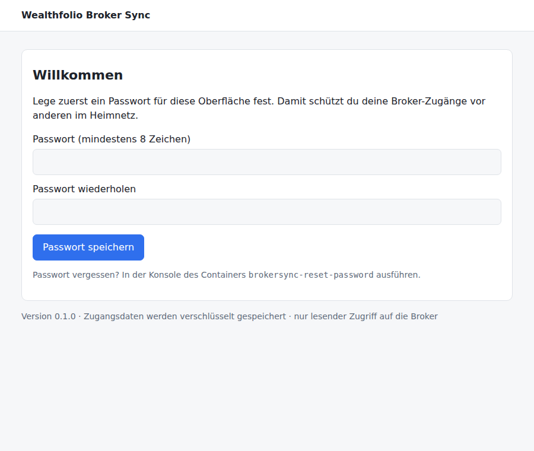
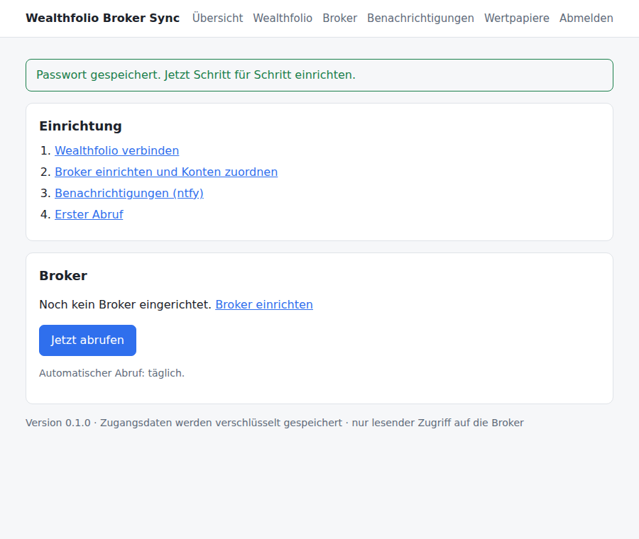
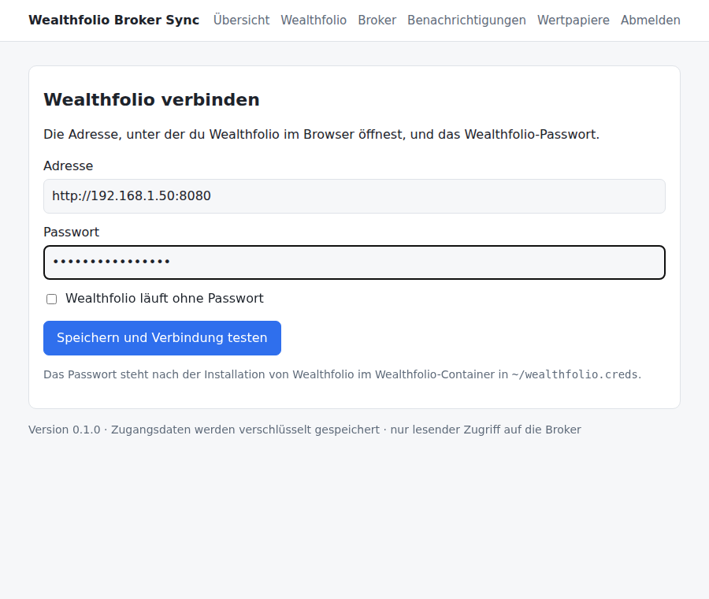
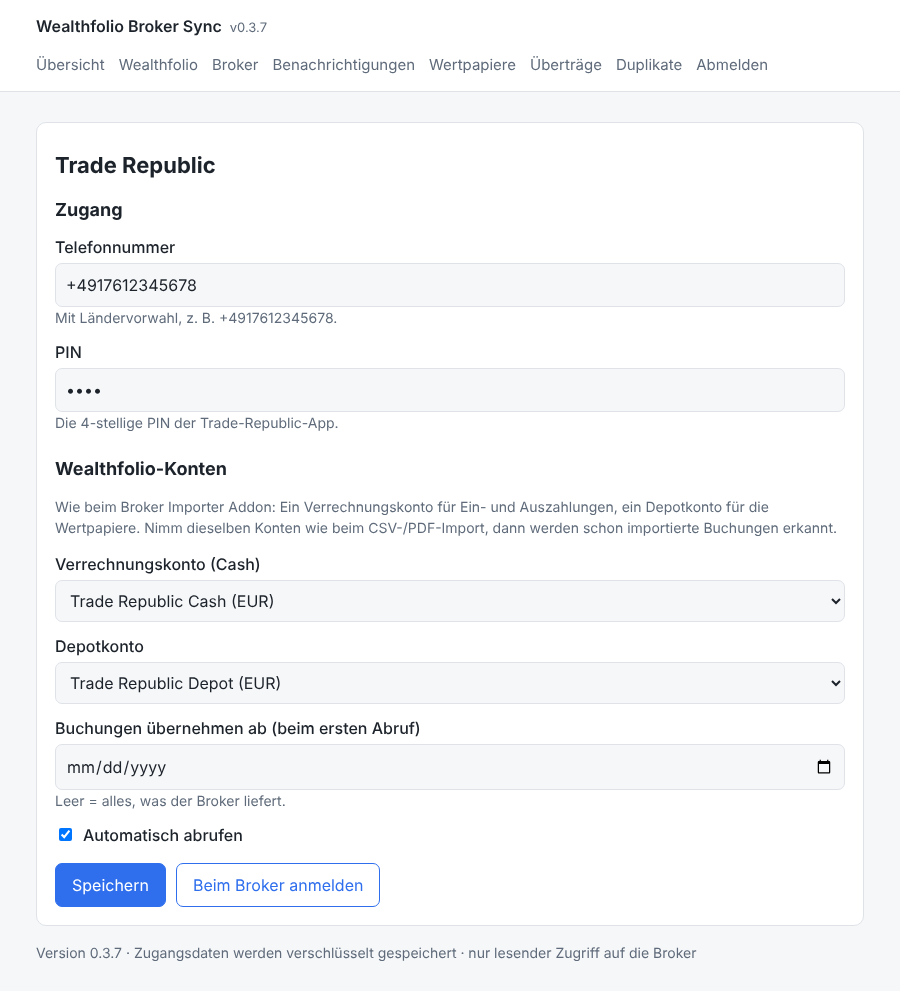
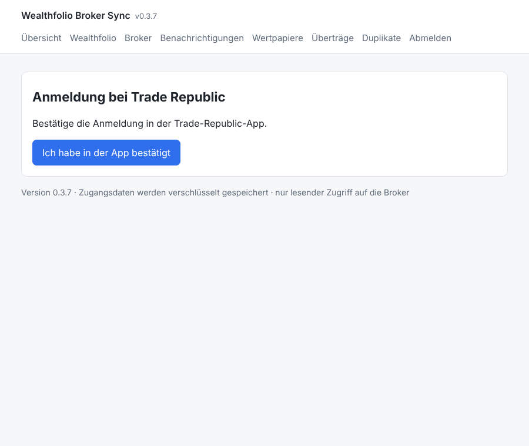
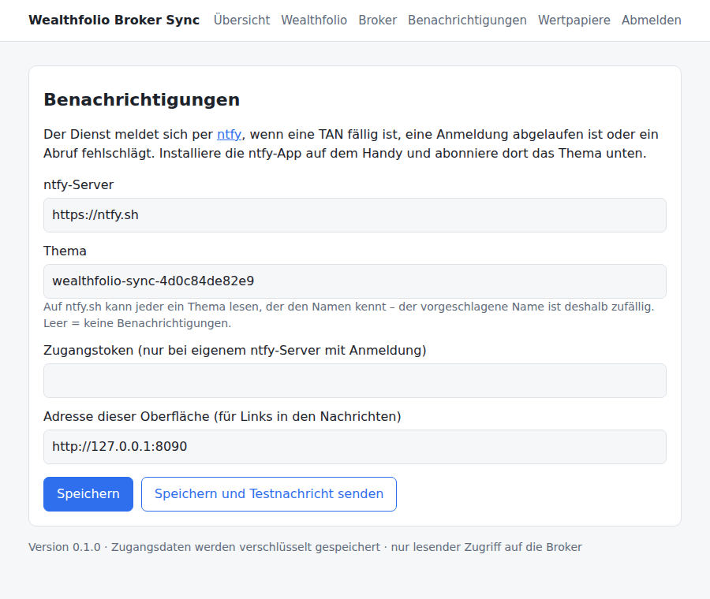
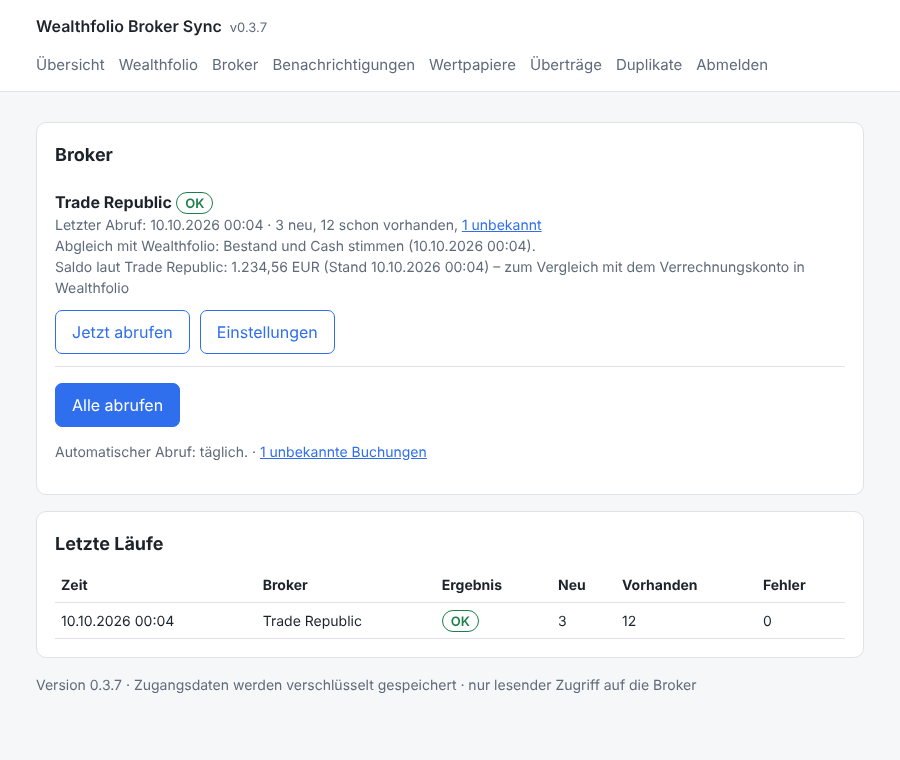

# Wealthfolio Broker Sync

Holt deine Buchungen automatisch bei deinen Brokern ab und trägt sie ohne Duplikate in dein **selbst gehostetes [Wealthfolio](https://wealthfolio.app)** ein. Einmal einrichten, danach läuft der Abruf täglich von selbst.

- **Installation mit einer Zeile** in der Proxmox-Shell, wie bei den [Community-Skripten](https://community-scripts.org): eigener Container, fertig eingerichtet
- **Alles in der Weboberfläche:** keine Konfigurationsdateien, keine Kommandozeile
- **Zugangsdaten verschlüsselt** gespeichert, **nur lesender Zugriff** auf die Broker
- **Benachrichtigung aufs Handy** (ntfy), wenn eine TAN fällig ist oder etwas nicht klappt
- **Bucht wie das [Broker Importer Addon](https://github.com/waldonso2/wealthfolio-importer-addon)**: Was du schon per CSV oder PDF importiert hast, wird erkannt und nicht doppelt angelegt

> **Stand:** **Trade Republic**, **DKB** (Girokonto per FinTS) und ein **Test-Broker („Dummy“)** zum Ausprobieren. Scalable Capital ([#39](https://github.com/waldonso2/wealthfolio-importer-addon/issues/39)) folgt.

## Was du brauchst

- einen **Proxmox-Server** (VE 8 oder 9)
- **Wealthfolio** als selbst gehostete Version (z. B. über das Community-Skript „Wealthfolio“) und das Wealthfolio-Passwort
- in Wealthfolio je Broker **zwei Konten**: ein Verrechnungskonto (Cash) und ein Depotkonto – dieselben wie beim Broker Importer Addon. Für den Test mit dem Dummy legst du am besten zwei Testkonten an, z. B. „Test Cash“ und „Test Depot“.
- optional die App **ntfy** auf dem Handy ([Android](https://play.google.com/store/apps/details?id=io.heckel.ntfy), [iOS](https://apps.apple.com/app/ntfy/id1625396347))

## Installation

1. **Proxmox-Shell öffnen.** In der Proxmox-Oberfläche links deinen Server (Knoten) wählen, dann oben rechts *>_ Shell*.
2. **Diese Zeile einfügen und Enter drücken:**

   ```bash
   bash -c "$(curl -fsSL https://raw.githubusercontent.com/waldonso2/wealthfolio-broker-sync-service/main/ct/wealthfolio-broker-sync.sh)"
   ```

   Es erscheint der bekannte Assistent der Community-Skripte. *Default Settings* wählen – die Standardwerte passen: 1 CPU, 512 MB RAM, 2 GB Disk, Debian 13, unprivilegiert. Der Kopf zeigt dabei „Scripts fork: waldonso2/wealthfolio-broker-sync-service“; das ist richtig, der Dienst kommt aus diesem Repository und nicht aus der offiziellen Sammlung.
3. **Öffnen.** Am Ende zeigt die Installation die Adresse der Weboberfläche an, z. B. `http://192.168.1.51:8090`. Diese im Browser öffnen.

**Aktualisieren:** In Proxmox die Konsole des Containers öffnen und `update` eingeben. Einstellungen und Zugangsdaten bleiben erhalten; vorher wird eine Sicherung unter `/opt/wealthfolio-broker-sync/backup-*.tar.gz` angelegt (die letzten drei bleiben).

> **PVE Scripts Local:** Der Dienst erscheint dort (noch) nicht. PVE Scripts Local zeigt nur Skripte aus der offiziellen Sammlung von community-scripts.org an; ein unter *Repositories* eingetragenes eigenes Repo bringt keine neuen Skripte in den Katalog. Die Aufnahme in die offizielle Sammlung ist geplant, sobald echte Broker angebunden sind.

## Einrichtung im Browser

### 1. Passwort für die Oberfläche festlegen

Beim ersten Öffnen legst du ein Passwort fest. Es schützt deine Broker-Zugänge vor anderen im Heimnetz.



Danach zeigt die Übersicht, was noch zu tun ist:



### 2. Wealthfolio verbinden

Die Adresse, unter der du Wealthfolio öffnest, und das Wealthfolio-Passwort. Nach dem Speichern wird die Verbindung sofort getestet.



### 3. Broker einrichten

Zugangsdaten eintragen und die beiden Wealthfolio-Konten wählen. Mit *Buchungen übernehmen ab* bestimmst du, wie weit der erste Abruf zurückgeht. *Automatisch abrufen* anhaken.



### 4. Beim Broker anmelden

Nach dem Speichern meldet sich der Dienst beim Broker an. Will der Broker eine TAN oder eine Bestätigung in seiner App, fragt die Seite danach. (Beim Dummy lautet der Code `000000`.)

> **Testbuchungen des Dummys** tragen das Datum des Tages, an dem du dich beim Dummy anmeldest, liegen ein paar Stunden davor und sind mit **TEST** gekennzeichnet: im Text („TEST Kauf“ …) und im Kommentar (`[SYNC dummy:TEST-…]`). In Wealthfolio findest du sie unter *Activities* ganz oben und kannst sie danach löschen. Der tägliche Abruf legt sie nicht erneut an; eine neue Anmeldung beim Dummy an einem anderen Tag erzeugt einen neuen Satz.



### 5. Benachrichtigungen

ntfy-App öffnen, *Thema abonnieren* und den Themennamen von dieser Seite eintragen. Mit *Testnachricht senden* prüfen.



### 6. Erster Abruf

In der Übersicht **Alle abrufen** klicken (oder bei einem Broker **Jetzt abrufen**). Danach siehst du je Broker, was neu angelegt wurde und was schon in Wealthfolio war. Broker mit ausgeschaltetem *Automatisch abrufen* überspringt der tägliche Lauf und „Alle abrufen“ – sie rufst du mit ihrem eigenen Button ab.



Ab jetzt läuft der Abruf jeden Morgen zwischen 6:00 und 6:45 Uhr.

## DKB

Der Dienst liest dein **DKB-Girokonto** per FinTS (HBCI), dieselbe Schnittstelle, die Finanzprogramme wie Hibiscus oder MoneyMoney nutzen. Er liest nur; Überweisungen kann er nicht auslösen.

**Einrichten** unter *Broker → DKB*:

- **Anmeldename und PIN:** dieselben wie im DKB-Banking.
- **IBAN des Girokontos:** nur nötig, wenn du bei der DKB mehrere Konten hast.
- **FinTS-Produkt-ID:** Banken verlangen für FinTS eine bei der Deutschen Kreditwirtschaft registrierte Produkt-ID. Sobald dieser Dienst eine hat, ist sie fest eingebaut und das Feld entfällt. Bis dahin trägst du hier eine registrierte Produkt-ID ein.
- **Konten:** dasselbe DKB-Verrechnungs- und Depotkonto wie beim PDF-Import im Addon.

**Freigabe in der DKB-App:** Bei der ersten Anmeldung und danach in Abständen (nach den PSD2-Regeln meist alle 90 Tage) will die DKB eine Bestätigung in der DKB-App. In der Oberfläche bestätigst du in der App und klickst dann *Ich habe in der App bestätigt*. Läuft gerade der tägliche Abruf, schickt der Dienst eine ntfy-Nachricht und wartet drei Minuten auf deine Freigabe.

**Was gebucht wird:**

| Auf dem Girokonto | In Wealthfolio (DKB-Verrechnungskonto) |
|---|---|
| Gutschrift, Gehalt, eingehende Überweisung | Einzahlung (DEPOSIT) – eingehendes Geld ist immer eine Einzahlung, wie im Addon |
| Kartenzahlung, Lastschrift, ausgehende Überweisung | Auszahlung (WITHDRAWAL), also eine Ausgabe |
| Ausgehende Überweisung auf ein eigenes Konto | Übertrag (TRANSFER_OUT, mit Gegenbuchung auf dem gewählten Konto), wenn unter *Überträge* eingetragen – wie die Transfer-Muster im Addon |
| Habenzinsen / Kontoführungsentgelt beim Rechnungsabschluss | Zinsen (INTEREST) / Gebühr (FEE) |
| Wertpapierabrechnung, Ertragsgutschrift, Dividende | **nichts** – siehe unten |

**Wertpapiere:** Käufe, Verkäufe und Ausschüttungen deines DKB-Depots bucht der PDF-Import des Addons, samt der Abbuchung bzw. Gutschrift auf dem Verrechnungskonto. Damit nichts doppelt zählt, bucht der Dienst diese Girokonto-Umsätze nicht noch einmal. Er prüft nur, ob der PDF-Import sie schon gebucht hat (gleicher Betrag, höchstens 6 Tage auseinander). Fehlt das Gegenstück, bekommst du eine Nachricht: PDF-Abrechnung mit dem Addon importieren, der nächste Abruf erkennt sie dann. Ob die DKB Depotbestände über FinTS liefert, ist noch nicht geprüft; bis dahin bleibt dafür der PDF-Import.

**Zeitraum:** Ohne Datum unter *Buchungen übernehmen ab* holt der erste Abruf die letzten 89 Tage. Für ältere Umsätze verlangt die DKB eine Freigabe in der App.

**Saldo:** Die Übersicht zeigt nach jedem Abruf den Saldo laut DKB. Er sollte mit dem DKB-Verrechnungskonto in Wealthfolio übereinstimmen.

**Sicherheit:** Lehnt die DKB Anmeldename oder PIN ab, versucht der Dienst es nicht noch einmal, bis du die Zugangsdaten neu speicherst. Nach drei Fehlversuchen sperrt die DKB sonst das Online-Banking.

## Trade Republic

Der Dienst liest deine Trade-Republic-Timeline über die inoffizielle Schnittstelle der App, mit dem Open-Source-Projekt [pytr](https://github.com/pytr-org/pytr). Er liest nur; Orders oder Auszahlungen kann er nicht auslösen.

> **Bitte beachten:** Trade Republic bietet keine offizielle Schnittstelle. Die genutzte kann sich jederzeit ändern, dann klappt der Abruf bis zu einem Update nicht. Ein automatisierter Zugriff ist von Trade Republic vermutlich nicht vorgesehen. Wer das nicht möchte, nutzt weiter den CSV-Import im Addon.

**Einrichten** unter *Broker → Trade Republic*:

- **Telefonnummer** mit Ländervorwahl (z. B. `+4917612345678`) und die **PIN** der App.
- **Konten:** dasselbe Trade-Republic-Verrechnungs- und Depotkonto wie beim CSV-Import im Addon.

**Anmelden:** Die Anmeldung läuft wie im Browser auf app.traderepublic.com. Trade Republic schickt eine Anfrage in die App, die bestätigst du, und dann klickst du *Ich habe in der App bestätigt*. Die Handy-App bleibt dabei angemeldet. Nutzt dein Konto eine Authenticator-App, fragt die Seite nach deren Code. Die Sitzung hält eine Weile; läuft sie ab, schickt der tägliche Abruf eine ntfy-Nachricht und wartet zwei Minuten auf deine Bestätigung in der App.

**Was gebucht wird** – nach denselben Regeln wie der CSV-Import des Addons:

| In der Timeline | In Wealthfolio |
|---|---|
| Kauf, Sparplan, Verkauf | Kauf/Verkauf auf dem Depotkonto mit Gebühr und Steuer in eigenen Feldern, Geld per Übertrag vom bzw. zum Verrechnungskonto |
| Dividende, Ausschüttung | eine Dividende mit Nettobetrag und Quellensteuer, Geld per Übertrag aufs Verrechnungskonto |
| Saveback | Bonus (CREDIT/BONUS) auf dem Depotkonto, der den Kauf bezahlt – ohne Abbuchung vom Verrechnungskonto |
| Zinsen | Zinsen (INTEREST) mit Steuer |
| Vorabpauschale / Steuerkorrektur | Steuer (TAX) / Steuererstattung (CREDIT/TAX_REFUND) |
| Einzahlung, Kartenerstattung | Einzahlung (DEPOSIT) |
| Kartenzahlung, Überweisung | Auszahlung (WITHDRAWAL) oder – mit Eintrag unter *Überträge* – Übertrag aufs eigene Konto |
| Aktiensplit, Spin-off, Tausch, Depotübertrag, Private Markets | **nicht gebucht**, als unbekannt gemeldet – diese Kapitalmaßnahmen bildet der CSV-Import im Addon ab |

Reine Hinweise (Order angelegt/storniert, Dokumente, Adressänderung …) und stornierte Buchungen übernimmt der Dienst nicht.

**CSV-Import und Dienst zusammen:** Was du schon per CSV importiert hast, erkennt der Dienst und legt es nicht noch einmal an: gleiche Art, gleicher Betrag, höchstens 36 Stunden auseinander, bei Käufen und Verkäufen dieselbe Stückzahl. Das Wertpapier darf dabei unter einem anderen Symbol stehen (im Addon zugeordneter Ticker, im Dienst die ISIN).

**Duplikate aus Version 0.3.0/0.3.1:** Diese Versionen haben per CSV importierte Käufe, Verkäufe und Dividenden ein zweites Mal angelegt. Die Seite *Duplikate* zeigt sie neben der CSV-Buchung und löscht nach deiner Bestätigung nur die Kopie des Dienstes.

## Abgleich mit Wealthfolio

Nach jedem Abruf vergleicht der Dienst, was der Broker meldet, mit dem Stand in Wealthfolio: das Guthaben mit dem Cash des Verrechnungskontos und, bei Trade Republic und beim Dummy, jede Position mit dem Bestand des Depotkontos. Die Übersicht zeigt das Ergebnis. Eine Abweichung, die auch beim nächsten Abruf noch besteht, kommt als ntfy-Nachricht. Direkt nach neuen Buchungen rechnet Wealthfolio noch. Typische Ursachen: eine Kapitalmaßnahme, die per CSV-Import nachzuholen ist, oder Buchungen aus der Zeit vor dem ersten Abruf.

## Im Alltag

| Was passiert | Was du tust |
|---|---|
| Push-Nachricht „Anmeldung nötig“ | Auf die Nachricht tippen, TAN eingeben – fertig |
| Push-Nachricht „Abruf fehlgeschlagen“ | Übersicht öffnen, dort steht der Grund. Meist löst es sich beim nächsten Lauf von selbst |
| „unbekannte Buchungen“ | Der Dienst kennt eine Buchungsart noch nicht und hat sie **nicht** übernommen. Unter *Unbekannte Buchungen* steht, was es war – bei Bedarf von Hand in Wealthfolio eintragen und gern ein Issue mit dem Typ anlegen |
| Wertpapier soll in Wealthfolio unter seinem Ticker statt der ISIN laufen | Unter *Wertpapiere* die Zuordnung ISIN → Symbol eintragen (wie im Addon) |
| Passwort der Oberfläche vergessen | In Proxmox die Konsole des Containers öffnen und `brokersync-reset-password` eingeben. Beim nächsten Öffnen legst du ein neues fest |

## Wie gebucht wird

Genau wie beim Broker Importer Addon, damit sich Sync, CSV- und PDF-Import nicht in die Quere kommen:

- **Zwei Konten je Broker:** Käufe, Verkäufe und Dividenden auf dem Depotkonto, alles andere auf dem Verrechnungskonto. Das Geld für einen Kauf und der Erlös eines Verkaufs bzw. einer Dividende wandern als Übertrag (TRANSFER_OUT/TRANSFER_IN, verknüpft über `sourceGroupId`) zwischen den Konten, sodass auf dem Depotkonto kein Bargeld liegen bleibt. Wealthfolio zählt diese Überträge nicht als Ausgaben.
- **Gebühren und Steuern** stehen in den eigenen Feldern der Buchung; eine Dividende ist eine Buchung mit dem Nettobetrag und der Steuer. Eine Steuererstattung wird eine eigene Gutschrift (CREDIT/TAX_REFUND).
- **Keine Duplikate:**
  1. Der Dienst merkt sich jede übernommene Transaktion.
  2. Wealthfolio lehnt exakt gleiche Buchungen selbst ab.
  3. Vor dem Anlegen wird geprüft, ob es die Transaktion schon gibt, z. B. aus einem CSV- oder PDF-Import: gleiches Konto, gleiche Art und gleiches Wertpapier, höchstens 36 Stunden auseinander, gleiche Stückzahl, gleicher Betrag ±0,02.

  Bricht ein Lauf mittendrin ab, ergänzt der nächste die fehlenden Teile.
- Jede Buchung trägt im Kommentar `[SYNC <broker>:<id>]`.

## Technik

Für Mitwirkende: [ARCHITECTURE.md](ARCHITECTURE.md) erklärt Aufbau und Ablauf, [CLAUDE.md](CLAUDE.md) die Regeln und wie ein neuer Broker dazukommt.

- Python-Dienst `brokersync` (FastAPI-Oberfläche auf Port 8090, `brokersync run` für den systemd-Timer) unter `/opt/wealthfolio-broker-sync`; Daten in `/opt/wealthfolio-broker-sync/data` (Konfiguration, verschlüsselte Zugangsdaten, Sync-Status), läuft als eigener Benutzer `brokersync`.
- Wealthfolio wird über seine REST-API (`/api/v1`) mit dem Wealthfolio-Passwort angesprochen.
- Releases: Ein neuer Stand wird installierbar, sobald die Version in `pyproject.toml` erhöht und nach `main` gemergt ist; der Release-Workflow legt dann das GitHub-Release an, aus dem Installation und Update laden.

## Danke

- [pytr](https://github.com/pytr-org/pytr) (MIT) für die Anbindung an Trade Republic; die Testfälle für Trade Republic folgen dem Format seiner Test-Ereignisse.
- [python-fints](https://github.com/raphaelm/python-fints) (LGPL) für FinTS.

## Lizenz

MIT
