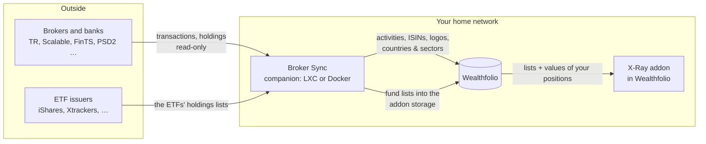

# Wealthfolio Broker Sync

Fetches your transactions from your brokers and banks automatically and books them, without duplicates, into your **self-hosted [Wealthfolio](https://wealthfolio.app)**. On top, it adds what Wealthfolio can't do on its own: the countries and sectors of your ETFs, ISINs, logos and a look-through into your ETFs (X-Ray). Set it up once, then everything runs by itself every morning.

- **Trade Republic, Scalable Capital, comdirect, DKB, Deutsche Bank, N26**, any other bank with **FinTS** (Sparkasse, Volksbank …) and any bank with a **PSD2** interface (through Enable Banking, so that bank's data passes through Enable Banking) – [details per bank](docs/BANKEN.md) (German)
- **No duplicates:** whatever is already in Wealthfolio, from a CSV or PDF import too, is recognised
- **Read-only access** to the brokers; **everything encrypted** (AES-256), the key is not stored with the data
- **Everything in the web UI**, with a notification on your phone (ntfy) when a TAN is due

## Contents

- [How the parts work together](#how-the-parts-work-together)
- [Requirements](#requirements)
- [Installation](#installation)
  - [Proxmox VE (LXC)](#proxmox-ve-lxc)
  - [Docker Compose](#docker-compose)
  - [Docker run](#docker-run)
  - [Podman](#podman)
  - [Unraid](#unraid)
  - [Behind a reverse proxy](#behind-a-reverse-proxy)
- [Updating](#updating)
- [Backup and restore](#backup-and-restore)
- [First setup](#first-setup)
- [Day to day](#day-to-day)
- [Security in brief](#security-in-brief)
- [How it came about](#how-it-came-about)
- [Thanks](#thanks)
- [Licence](#licence)

## How the parts work together


```mermaid
flowchart LR
  subgraph outside[Outside]
    B[Brokers and banks<br/>TR, Scalable, FinTS, PSD2 …]
    A[ETF issuers<br/>iShares, Xtrackers, …]
  end
  subgraph home[Your home network]
    C[Broker Sync<br/>companion: LXC or Docker]
    W[(Wealthfolio)]
    X[X-Ray addon<br/>in Wealthfolio]
  end
  B -->|transactions, holdings<br/>read-only| C
  A -->|the ETFs' holdings lists| C
  C -->|activities, ISINs, logos,<br/>countries & sectors| W
  C -->|fund lists into the<br/>addon storage| W
  W -->|lists + values of your positions| X
```

**Broker Sync** is the companion to Wealthfolio: it talks to brokers, banks and ETF issuers and writes only through Wealthfolio's own API. Every service that writes something into Wealthfolio can be switched on and off on its own on the start page *Services*. The **[X-Ray addon](https://github.com/waldonso2/wealthfolio-companion-addon-xray)** shows the look-through into your ETFs right inside Wealthfolio. It makes no network requests itself and only reads what the companion stores there.

## Requirements

- **Wealthfolio**, self-hosted (3.11 or newer for the X-Ray addon), and its password
- in Wealthfolio, **two accounts** per broker: a cash account and a securities account ([why](docs/FUNKTIONEN.md#wie-gebucht-wird), German)
- a **Proxmox VE** server (8 or 9) **or** a computer with **Docker** or **Podman** (amd64 or arm64), for example an **Unraid** server
- optionally the **ntfy** app on your phone ([Android](https://play.google.com/store/apps/details?id=io.heckel.ntfy), [iOS](https://apps.apple.com/app/ntfy/id1625396347))

## Installation

Pick the platform you run. Each one ends with the address of the web UI and a one-time **setup code**; continue with [First setup](#first-setup).

The image is published for `linux/amd64` and `linux/arm64`:

| Registry | Image |
|---|---|
| GHCR | `ghcr.io/waldonso2/wealthfolio-broker-sync:latest` |

### Proxmox VE (LXC)

The recommended way: a native LXC container built with the community-scripts engine, hardened with systemd. It runs the web UI and the daily timer, and its key is sealed with `systemd-creds`.

1. In the Proxmox web interface, select your server (the **host**, not an existing container) and open *>_ Shell*.
2. Paste and run the installer:

   ```bash
   bash -c "$(curl -fsSL https://raw.githubusercontent.com/waldonso2/wealthfolio-broker-sync-service/main/ct/wealthfolio-broker-sync.sh)"
   ```

3. Choose *Default Settings* (1 CPU, 512 MB RAM, 2 GB disk, Debian 13, unprivileged).
4. When it finishes, it prints the address of the UI (for example `https://192.168.1.51:8443`) and the setup code. Open the address and go on with [First setup](#first-setup).

Forgot the setup code? Open the container's console and run:

```bash
brokersync-cli setup-code
```

### Docker Compose

`deploy/docker-compose.example.yml` starts the companion, optionally together with Wealthfolio. The container runs as an unprivileged user (uid 10001) with a read-only file system and no capabilities; its key comes from a file mounted as a Compose secret and is never stored in the image or the data volume.

1. Create a folder for it and download the Compose file:

   ```bash
   mkdir -p ~/brokersync && cd ~/brokersync
   curl -fsSL -o docker-compose.yml https://raw.githubusercontent.com/waldonso2/wealthfolio-broker-sync-service/main/deploy/docker-compose.example.yml
   ```

2. Create the service's key. The container's user must be able to read it, so it is owned by uid 10001:

   ```bash
   openssl rand -base64 32 > brokersync.key
   sudo chown 10001:10001 brokersync.key && sudo chmod 600 brokersync.key
   ```

   **Keep a copy of this key somewhere safe** (for example in your password manager; `sudo cat brokersync.key` shows it). Without it the data can't be opened; with it and the data volume, it can – a master passphrase protects against that (see [Security in brief](#security-in-brief)).

3. **Without Wealthfolio yet** – the file also starts Wealthfolio. Give it a secret key and the hash of the password you want for Wealthfolio (the `argon2` tool comes from your distribution's `argon2` package, e.g. `sudo apt install argon2`):

   ```bash
   printf 'WF_SECRET_KEY=%s\n' "$(openssl rand -base64 32)" > .env
   read -rsp "Password for Wealthfolio: " WFPW; echo
   printf "WF_AUTH_PASSWORD_HASH='%s'\n" "$(printf '%s' "$WFPW" | argon2 "$(openssl rand -hex 16)" -id -e)" >> .env
   unset WFPW
   ```

   Wealthfolio accepts its UI only from the origins it is told (`http://localhost:8088` by default). To open it by this computer's IP address, add that origin:

   ```bash
   printf 'WF_CORS_ALLOW_ORIGINS=http://%s:8088\n' "$(hostname -I | awk '{print $1}')" >> .env
   ```

   **With Wealthfolio already running elsewhere** – replace the file with one that starts only the companion:

   ```bash
   cat > docker-compose.yml <<'EOF'
   services:
     brokersync:
       image: ghcr.io/waldonso2/wealthfolio-broker-sync:latest
       container_name: brokersync
       hostname: brokersync
       restart: unless-stopped
       ports:
         - "8443:8443"
         - "8090:8090"
       environment:
         TZ: Europe/Berlin
       secrets:
         - brokersync-key
       volumes:
         - brokersync-data:/data
         - brokersync-tls:/tls
       read_only: true
       tmpfs:
         - /tmp:size=64M,mode=1777
       cap_drop: [ALL]
       security_opt:
         - no-new-privileges:true
   secrets:
     brokersync-key:
       file: ./brokersync.key
   volumes:
     brokersync-data:
     brokersync-tls:
   EOF
   ```

4. Start it:

   ```bash
   docker compose up -d
   ```

5. Read the setup code from the log:

   ```bash
   docker compose logs brokersync
   ```

6. Open `https://<this computer's IP address>:8443` and go on with [First setup](#first-setup). In the UI, Wealthfolio's address is `http://wealthfolio:8088` when it runs from the same Compose file, else its own address.

To have the computer's name in the UI's certificate as well, uncomment `BROKERSYNC_CERT_NAMES` in the Compose file and put in that name (several separated by commas). `BROKERSYNC_RUN_AT` moves the daily fetch (German time, plus up to 45 minutes; default 06:00).

### Docker run

The same container without Compose.

1. Create a folder and the key, owned by the container's user (keep a copy, as above):

   ```bash
   mkdir -p ~/brokersync && cd ~/brokersync
   openssl rand -base64 32 > brokersync.key
   sudo chown 10001:10001 brokersync.key && sudo chmod 600 brokersync.key
   ```

2. Start the container:

   ```bash
   docker run -d --name brokersync --hostname brokersync --restart unless-stopped \
     -p 8443:8443 -p 8090:8090 -e TZ=Europe/Berlin \
     --read-only --tmpfs /tmp:size=64M,mode=1777 --cap-drop ALL --security-opt no-new-privileges:true \
     -v brokersync-data:/data -v brokersync-tls:/tls \
     -v "$PWD/brokersync.key:/run/secrets/brokersync-key:ro" \
     ghcr.io/waldonso2/wealthfolio-broker-sync:latest
   ```

3. Read the setup code from the log:

   ```bash
   docker logs brokersync
   ```

4. Open `https://<this computer's IP address>:8443` and go on with [First setup](#first-setup).

### Podman

The image runs under Podman the same way; rootless Podman maps the container's uid 10001 into your user namespace, so the key is handed over with `podman unshare`.

1. Create a folder and the key (keep a copy, as above):

   ```bash
   mkdir -p ~/brokersync && cd ~/brokersync
   openssl rand -base64 32 > brokersync.key
   chmod 600 brokersync.key && podman unshare chown 10001:10001 brokersync.key
   ```

2. Start the container:

   ```bash
   podman run -d --name brokersync --hostname brokersync --restart unless-stopped \
     -p 8443:8443 -p 8090:8090 -e TZ=Europe/Berlin \
     --read-only --tmpfs /tmp:size=64M,mode=1777 --cap-drop ALL --security-opt no-new-privileges \
     -v brokersync-data:/data -v brokersync-tls:/tls \
     -v "$PWD/brokersync.key:/run/secrets/brokersync-key:ro,Z" \
     ghcr.io/waldonso2/wealthfolio-broker-sync:latest
   ```

3. Read the setup code from the log:

   ```bash
   podman logs brokersync
   ```

4. Open `https://<this computer's IP address>:8443` and go on with [First setup](#first-setup).

### Unraid

Unraid runs the same image as a Docker container. There is no Community Applications template yet, so the container is created once in Unraid's terminal; afterwards it shows up on the *Docker* tab like any other container (start, stop, logs, autostart). The data lives in `appdata`.

1. Open the terminal (the `>_` icon at the top right of the Unraid web UI) and create the folders and the key, owned by the container's user (keep a copy of the key outside the server, e.g. in your password manager):

   ```bash
   mkdir -p /mnt/user/appdata/brokersync/data /mnt/user/appdata/brokersync/tls
   openssl rand -base64 32 > /mnt/user/appdata/brokersync/brokersync.key
   chown -R 10001:10001 /mnt/user/appdata/brokersync
   chmod 600 /mnt/user/appdata/brokersync/brokersync.key
   ```

2. Start the container (port 8443 for the UI; change the left-hand numbers if those ports are taken on your server):

   ```bash
   docker run -d --name brokersync --hostname brokersync --restart unless-stopped \
     -p 8443:8443 -p 8090:8090 -e TZ=Europe/Berlin \
     --read-only --tmpfs /tmp:size=64M,mode=1777 --cap-drop ALL --security-opt no-new-privileges:true \
     -v /mnt/user/appdata/brokersync/data:/data -v /mnt/user/appdata/brokersync/tls:/tls \
     -v /mnt/user/appdata/brokersync/brokersync.key:/run/secrets/brokersync-key:ro \
     ghcr.io/waldonso2/wealthfolio-broker-sync:latest
   ```

3. Read the setup code from the log (or on the *Docker* tab: click the container's icon → *Logs*):

   ```bash
   docker logs brokersync
   ```

4. Open `https://<your Unraid server's IP address>:8443` and go on with [First setup](#first-setup). On the *Docker* tab, turn on *Autostart* for `brokersync`, so it starts with the array.

**Updating on Unraid** – the *Docker* tab cannot update a container that was created without a template, so pull the new image and create the container again with the command from step 2 (the data in `appdata` stays):

```bash
docker pull ghcr.io/waldonso2/wealthfolio-broker-sync:latest
docker stop brokersync && docker rm brokersync
```

**Backup on Unraid** – `appdata` is covered by the *Appdata Backup* plugin; that backup holds data **and** key, so keep it on an encrypted target or set the master passphrase. A backup of the data only:

```bash
(umask 077; docker exec brokersync brokersync backup > /mnt/user/appdata/brokersync-$(date +%F).tar.gz)
```

### Behind a reverse proxy

Behind a proxy, every request seems to come from the proxy's address, so five wrong passwords from anyone would lock everybody out. Tell the companion the proxy's address: then only that proxy's `X-Forwarded-For` header is believed, and the lock-out counts per real client. The UI also answers only to its IP addresses and known names, so add the public name the proxy uses.

**Docker Compose**

1. In `docker-compose.yml`, under `environment:` of `brokersync`, add these lines: `BROKERSYNC_TLS` switches the UI to plain HTTP on port 8090 (the proxy does TLS), `BROKERSYNC_TRUST_PROXY` is the proxy's IP address as the container sees it (several separated by commas), `BROKERSYNC_ALLOWED_HOSTS` the public name:

   ```yaml
         BROKERSYNC_TLS: "off"
         BROKERSYNC_TRUST_PROXY: "172.18.0.5"
         BROKERSYNC_ALLOWED_HOSTS: "brokersync.example.com"
   ```

2. Remove the `ports:` of `brokersync` when the proxy reaches it over a Docker network, so nobody bypasses the proxy.
3. Point the proxy to `http://brokersync:8090` (or the computer's address and port 8090).
4. Apply it:

   ```bash
   docker compose up -d
   ```

With `docker run` or Podman, add the same values as `-e BROKERSYNC_TLS=off -e BROKERSYNC_TRUST_PROXY=… -e BROKERSYNC_ALLOWED_HOSTS=…`.

**Proxmox VE (LXC)**

The LXC keeps HTTPS on port 8443; point the proxy to `https://<container IP>:8443` (it may trust the container's CA from the page *Security*).

1. In the container's console, write a drop-in – put in your proxy's IP address and the public name:

   ```bash
   mkdir -p /etc/systemd/system/wealthfolio-broker-sync.service.d
   cat > /etc/systemd/system/wealthfolio-broker-sync.service.d/20-proxy.conf <<'EOF'
   [Service]
   Environment=BROKERSYNC_TRUST_PROXY=192.168.1.10
   Environment=BROKERSYNC_ALLOWED_HOSTS=brokersync.example.com
   EOF
   ```

2. Restart the UI:

   ```bash
   systemctl daemon-reload && systemctl restart wealthfolio-broker-sync
   ```

On every platform, enter the public address on the page *Notifications*, so the links in notifications open through the proxy.

## Updating

Settings, credentials and data stay; the data is migrated at start.

**Proxmox VE (LXC)**

1. Open the container's console and run:

   ```bash
   update
   ```

   It backs up the encrypted data first (`/opt/wealthfolio-broker-sync/backup-*.tar.gz`, the last three are kept) and checks every downloaded file against the release's checksums (`SHA256SUMS`); if one doesn't match, it stops and the current version keeps running.

2. Or let the container update itself: page *Updates* (opt-in, asks for the UI password).

**Docker Compose**

1. In the folder with `docker-compose.yml`:

   ```bash
   docker compose pull && docker compose up -d
   ```

**Docker run / Podman**

1. Fetch the new image, then remove the container (the volumes stay):

   ```bash
   docker pull ghcr.io/waldonso2/wealthfolio-broker-sync:latest
   docker rm -f brokersync
   ```

2. Run the `docker run` command from [Docker run](#docker-run), step 2, again. With Podman, use `podman` in both steps and the command from [Podman](#podman), step 2.

## Backup and restore

A backup holds only encrypted data, never the key. **It is complete only together with the key** (in Docker your `brokersync.key`, in the LXC `/etc/wealthfolio-broker-sync`): without it the data is worthless. `restore` first checks that the backup opens with this installation's key (and the master passphrase, if set); otherwise it changes nothing. The previous state is kept as `before-restore-*.tar.gz` in the data.

**Proxmox VE (LXC)** – the easiest complete backup is Proxmox's backup of the whole container; it holds key and data, so keep it on an encrypted target or set the master passphrase. By hand, in the container's console:

1. Back up:

   ```bash
   (umask 077; brokersync-cli backup > /root/brokersync-$(date +%F).tar.gz)
   ```

2. Restore – stop the UI, restore the file (put in its name; `ls /root/brokersync-*` lists them, `update`'s backups in `/opt/wealthfolio-broker-sync/` work too), start again:

   ```bash
   systemctl stop wealthfolio-broker-sync
   brokersync-cli restore < /root/brokersync-2026-10-15.tar.gz
   systemctl start wealthfolio-broker-sync
   ```

**Docker Compose** – in the folder with `docker-compose.yml`:

1. Back up:

   ```bash
   (umask 077; docker compose exec -T brokersync brokersync backup > brokersync-$(date +%F).tar.gz)
   ```

2. Restore – stop the companion, restore the file (put in its name) in a one-off container, start again:

   ```bash
   docker compose stop brokersync
   docker compose run --rm -T brokersync restore < brokersync-2026-10-15.tar.gz
   docker compose start brokersync
   ```

**Docker run / Podman** (with Podman, `podman` instead of `docker`; with rootless Podman, put `:ro,Z` at the end of the key's `-v`):

1. Back up:

   ```bash
   (umask 077; docker exec brokersync brokersync backup > brokersync-$(date +%F).tar.gz)
   ```

2. Restore – stop the companion, restore the file (put in its name), start again:

   ```bash
   docker stop brokersync
   docker run --rm -i --read-only --tmpfs /tmp:size=64M,mode=1777 --cap-drop ALL \
     -v brokersync-data:/data -v "$PWD/brokersync.key:/run/secrets/brokersync-key:ro" \
     ghcr.io/waldonso2/wealthfolio-broker-sync:latest restore < brokersync-2026-10-15.tar.gz
   docker start brokersync
   ```

## First setup

The UI starts in German; *Einstellungen → Darstellung* switches it to English (*Settings → Appearance*). The page names below are the English ones.

1. **Password:** set it with the setup code, which appears only in the console or the container's log.
2. **Certificate:** confirm the browser's warning the first time. On the page *Security*, download the CA certificate and import it once; after that the connection counts as secure.
3. **Connect Wealthfolio:** address and password. *Test only* checks the connection without saving.
4. **Set up a broker:** credentials, the two accounts and the start date. The service then logs in and asks for a TAN or an app confirmation.
5. **Switch the services on:** on the start page *Services*, switch on the **Broker sync** and whatever else you want. On a new installation everything is off; if something is missing, the settings it needs open.
6. **Notifications:** subscribe to the topic from the page *Notifications* in the ntfy app.
7. **First fetch:** page *Brokers* → **Fetch all**. After that the fetch runs every morning between 6:00 and 6:45 (German time).

<picture><source media="(prefers-color-scheme: dark)" srcset="docs/screenshots/07-nach-dem-abruf-dunkel.png"></picture>

## Day to day

| What happens | What you do |
|---|---|
| Push "login needed" | Tap it, enter the TAN – done |
| Push "fetch failed" | Open the page *Brokers*, the reason is there |
| "unknown transactions" | Under *Brokers → Unknown*, say what it is; the next fetch books it |
| Deviation from Wealthfolio | *Brokers → Check*: book missing activities again or ignore them |
| What's inside my ETFs? | Page *X-Ray*, or in Wealthfolio with the X-Ray addon |
| Forgot the password | LXC console: `brokersync-reset-password`; Docker: `docker exec -it brokersync brokersync reset-ui-password` |

Everything else – reconciliation, X-Ray, costs and FIRE, the booking model, proxy, logs, metrics – is in [docs/FUNKTIONEN.md](docs/FUNKTIONEN.md) (German). Updates, security, backup and technical details are in [docs/BETRIEB.md](docs/BETRIEB.md) (German).

## Security in brief

- Credentials, settings and the sync database are encrypted (AES-256-GCM and SQLCipher). The service's key lives outside the data: in Proxmox sealed with `systemd-creds`, in Docker as a secret.
- **Master passphrase (optional):** with it, even a copy that includes the key opens nothing. Without the passphrase the data is lost.
- Read-only access to the brokers; protection against lock-outs (no second wrong PIN or TAN); the UI only over HTTPS, with its own login and throttled failed attempts.
- The page *Security* always shows what is protected and how. Please report vulnerabilities privately: [SECURITY.md](SECURITY.md).

## How it came about

This project was built entirely on a phone, in conversation with Claude: code, tests, reviews and releases.

## Thanks

- [pytr](https://github.com/pytr-org/pytr) (MIT) for Trade Republic
- [python-fints](https://github.com/raphaelm/python-fints) (LGPL) for FinTS
- [Scalable CLI](https://github.com/ScalableCapital/scalable-cli) (Apache-2.0) by Scalable Capital; the mapping of transaction types follows the [Scalable Capital Transactions Exporter](https://github.com/matthesvoss/Scalable-Capital-Transactions-Exporter) (MIT)

## Licence

MIT
